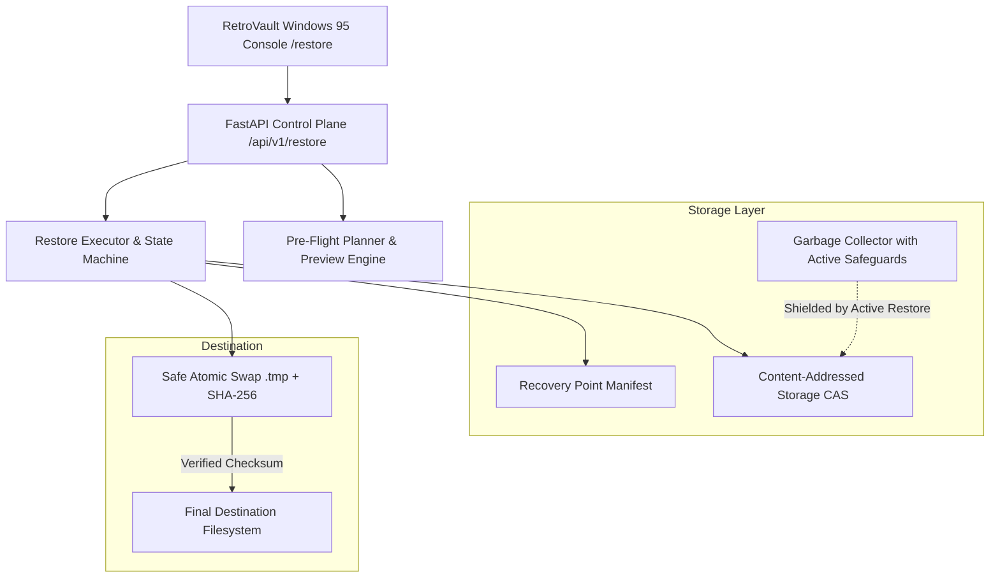

# RetroVault Backup Engine — V6: Restore & Disaster Recovery

## 1. Executive Architecture Overview

RetroVault Backup Engine Version 6 (V6) completes the end-to-end data protection lifecycle by delivering **production-grade Restore and Disaster Recovery (DR)** capabilities. Building seamlessly upon V1 (Universal Windows Agent & Service), V2 (Full Backups & Streaming SHA-256 CAS), V3 (Incremental Backups & Tombstoning), V4 (VSS Snapshots & Resilient Resumption), and V5 (Deduplication, Compression & GFS Retention), V6 enables atomic, verifiable restoration from any point-in-time recovery point to any original or alternate destination.

---

## 2. Core Capabilities & Mechanics

### 2.1 Virtual Recovery Point Reconstruction
- **Point-in-Time Accurate Manifest**: V6 traverses baseline and incremental backup runs to build the exact logical tree of active files at that instant.
- **Tombstone Filtering**: Deleted files (`change_type == 'DELETED'`) are strictly excluded from restore manifests and never written to target disks.
- **Deduplication Resolution**: Inherited `UNCHANGED` files correctly resolve to their underlying `StorageObject` content address.

### 2.2 Pre-Flight Restore Preview
The `POST /api/v1/restore/preview` API simulates the entire restore operation prior to touching a single byte on disk:
- Inspects target filesystem to detect collisions.
- Calculates exact logical restore bytes vs. estimated compressed CAS bytes read.
- Emits an action breakdown: `CREATE`, `OVERWRITE`, `SKIP`, `CONFLICT`, `RENAME`.
- Guarantees zero side-effects during planning.

### 2.3 Atomic & Safe File Restoration
- **Zero-Corruption Guarantee**: File chunks are streamed directly into `.retrovault_restore_<id>.tmp` files.
- **Checksum Verification**: The client verifies the reassembled file's SHA-256 hash against the manifest *before* replacing any existing file.
- **Atomic Replacement**: On POSIX and Windows (`os.replace`), files are swapped atomically so an interrupted write can never leave a damaged file.

### 2.4 Resilient & Resumable State Machine
The restore lifecycle is governed by an explicit 14-state machine:
`CREATED` -> `VALIDATING` -> `PLANNING` -> `QUEUED` -> `RUNNING` -> `VERIFYING` -> `COMPLETING` -> `COMPLETED`
(with branches for `PAUSED`, `INTERRUPTED`, `RESUMING`, `PARTIAL`, `FAILED`, and `CANCELLED`).

- **Per-Item Tracking**: Every file is tracked via `RestoreItem` (`PENDING`, `IN_PROGRESS`, `VERIFIED`, `COMPLETED`, `SKIPPED`, `FAILED`).
- **Atomic Checkpoints**: Checkpoints record byte offsets and completed item IDs in `restore_checkpoints`.
- **Intelligent Resumption**: Resuming skips already verified files on disk, avoiding redundant network transfers and disk I/O.

### 2.5 Conflict Handling Policies
Configurable per restore job:
- **`OVERWRITE`**: Atomically replaces destination file after verifying destination checksum.
- **`SKIP`**: Leaves existing target file untouched and records status `SKIPPED`.
- **`RENAME`**: Writes recovered file as `<name> (Restored).<ext>` or `<name> (Restored N).<ext>`.
- **`FAIL`**: Immediately aborts the restore job if a target file already exists.

### 2.6 Cross-Client Disaster Recovery & Security
- **Role-Based Access Control (RBAC)**: Restore jobs require `admin` or `operator` roles; previews require `viewer` or higher.
- **Cross-Client Authorization**: Restoring data from Client A onto Client B requires explicit administrator confirmation (`acknowledge_cross_client=true`). Unauthorized attempts return HTTP 400.
- **Audit Logging**: All preview, creation, pause, resume, cancel, and cross-client events are recorded in `audit_logs`.
- **Path Sanitization**: Protects against directory traversal (`..`) and Windows reserved device names (`CON`, `PRN`, `AUX`, `NUL`, `COM1-9`, `LPT1-9`).

### 2.7 Active Restore Safeguards
- **Garbage Collection Immunity**: Active restore jobs register their referenced `StorageObject` IDs. `GarbageCollector.get_active_referenced_storage_ids()` ensures no object currently being restored can be swept or deleted.
- **Retention Expiration Lock**: Active restore jobs protect their associated `RecoveryPoint` from retention pruning policies.

### 2.8 Recovery Time Objective (RTO) Telemetry
Detailed RTO metrics are recorded on completion:
- **Queue Time**: Duration between job creation and first validation step.
- **Startup Time**: Time to initialize destination directories and CAS streams.
- **Restore Duration**: Active write and verification time.
- **Total Restore Time**: End-to-end wall clock time.
- **Transfer Speed**: Average throughput in MB/s.

---

## 3. REST API Specification

| Endpoint | Method | Role | Description |
| :--- | :--- | :--- | :--- |
| `/api/v1/recovery-points/{id}/files` | `GET` | Viewer+ | Retrieve virtual logical tree for a recovery point |
| `/api/v1/recovery-points/{id}/files/search` | `GET` | Viewer+ | Search and filter files in recovery point by name or extension |
| `/api/v1/restore/preview` | `POST` | Viewer+ | Pre-flight restore dry-run calculation |
| `/api/v1/restore/jobs` | `POST` | Operator+ | Create and optionally start a restore job |
| `/api/v1/restore/jobs` | `GET` | Viewer+ | List all restore jobs with optional status filter |
| `/api/v1/restore/jobs/{id}` | `GET` | Viewer+ | Get job details and RTO metrics |
| `/api/v1/restore/jobs/{id}/start` | `POST` | Operator+ | Start an existing restore job |
| `/api/v1/restore/jobs/{id}/pause` | `POST` | Operator+ | Pause an in-flight restore job |
| `/api/v1/restore/jobs/{id}/resume` | `POST` | Operator+ | Resume an interrupted/paused restore job |
| `/api/v1/restore/jobs/{id}/cancel` | `POST` | Operator+ | Abort an active restore job |
| `/api/v1/restore/jobs/{id}/items` | `GET` | Viewer+ | List file-by-file tracking records |
| `/api/v1/restore/jobs/{id}/logs` | `GET` | Viewer+ | Retrieve audit logs for a restore job |

---

## 4. Frontend Windows 95 Console (`/restore`)

The frontend console implements an authentic Windows 95 user experience:
1. **Recovery Point Selector**: Dropdown displaying client hostname, point timestamp, and backup type (FULL / INCREMENTAL).
2. **Virtual Explorer & Search**: Explorer tree and search bar allowing item selection or full recovery point selection.
3. **Destination & Conflict Matrix**: Radio buttons for Original vs. Alternate path, and conflict policies (`OVERWRITE`, `SKIP`, `RENAME`, `FAIL`).
4. **Pre-Flight Preview Modal**: Modal summarizing total files, bytes, and action breakdown before starting.
5. **Live Telemetry Dashboard**: Progress bar, transfer speed (MB/s), ETA countdown, verified count, and file counter.
6. **Past Restore Jobs Ledger**: Historical log of completed, paused, and failed operations with per-item status views.

---

## 5. Verification Matrix

### 5.1 Automated Pytest Suite
- **Result**: `107 passed, 4 warnings in 22.69s` (100% Pass Rate).
- **Scope**: 92 existing baseline tests (V1–V5) + 15 new V6 API and Agent restore tests.
- **Coverage**: Previews, virtual trees, path sanitization, atomic overwrites, rename conflicts, skip logic, CAS decompression, active GC protection, resume state machines.

### 5.2 25-Step Live E2E Disaster Recovery Simulation (`test_v6_restore_disaster_recovery.py`)
| Step | Phase | Action / Test | Result |
| :---: | :--- | :--- | :---: |
| 01 | Setup | Create Workstation Client A | PASS |
| 02 | Data Prep | Create initial files on Client A (report, data.csv, image.jpg) | PASS |
| 03 | Backup 1 | Run FULL Backup -> Recovery Point #1 | PASS |
| 04 | Modification | Modify report.txt | PASS |
| 05 | Tombstone | Delete image.jpg | PASS |
| 06 | Addition | Create new.txt | PASS |
| 07 | Backup 2 | Run INCREMENTAL Backup -> Recovery Point #2 | PASS |
| 08 | Manifest | Reconstruct logical point-in-time state (tombstone omitted) | PASS |
| 09 | Disaster | Simulate local disaster (files wiped) | PASS |
| 10 | Targeting | Designate DR target root | PASS |
| 11 | Preview | Pre-flight dry run preview calculation | PASS |
| 12 | Restore | Execute full point-in-time restore to alternate root | PASS |
| 13 | Integrity | Verify SHA-256 checksums match original source bytes | PASS |
| 14 | Tombstone | Confirm deleted file image.jpg was NOT restored | PASS |
| 15 | Conflict 1 | Test SKIP policy (preserves existing target file) | PASS |
| 16 | Conflict 2 | Test RENAME policy (writes `(Restored)` duplicate) | PASS |
| 17 | Conflict 3 | Test OVERWRITE policy (atomic temp-file swap) | PASS |
| 18 | Interruption | Simulate restore interruption / process kill | PASS |
| 19 | Resumption | Resume interrupted job to completion | PASS |
| 20 | RBAC / Auth | Block unacknowledged cross-client restore; allow with flag | PASS |
| 21 | Corruption | Reject corrupted CAS StorageObject (`SOURCE_OBJECT_CORRUPTED`) | PASS |
| 22 | GC Shield | Protect active restore CAS objects from Garbage Collector | PASS |
| 23 | Finalization | Finalize in-flight restore job | PASS |
| 24 | Audit | Verify audit log records all preview & restore actions | PASS |
| 25 | Telemetry | Verify RTO metrics (queue, startup, duration, transfer speed) | PASS |

### 5.3 Production Frontend Build
- **Command**: `npm run build` (`tsc -b && vite build`)
- **Result**: Built successfully in 493ms with zero TypeScript errors or warnings.
