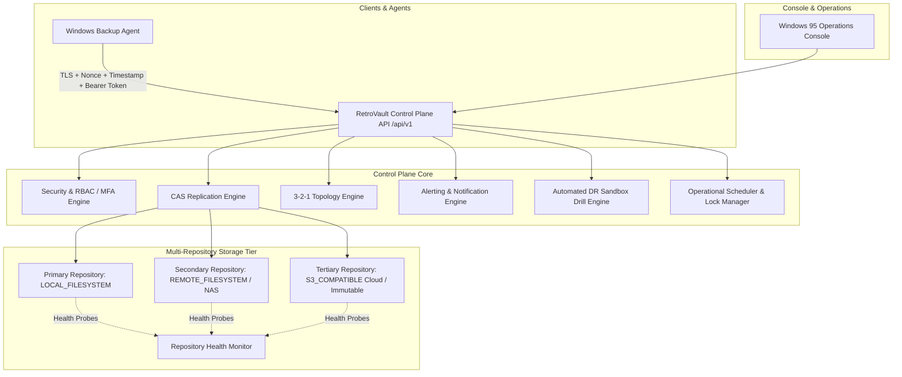

# RetroVault Backup Engine — V7: Enterprise Operations, Offsite Replication & Security

## 1. Executive Architecture Overview

RetroVault Backup Engine Version 7 (V7) transforms the platform into an enterprise-grade, multi-repository, compliance-ready data protection ecosystem. Building on V1 (Universal Windows Agent), V2 (Full Backups & Streaming SHA-256 CAS), V3 (Incremental Backups & Tombstoning), V4 (VSS Snapshots & Resilient Resumption), V5 (Deduplication, Compression & GFS Retention), and V6 (Restore & Disaster Recovery), V7 delivers **multi-repository topology management, CAS-aware offsite replication, 3-2-1 compliance verification, agent credential rotation, administrative TOTP MFA, granular RBAC, alerting, automated sandbox DR testing, and centralized enterprise settings**.

---

## 2. Core Capabilities & Architectural Subsystems

### 2.1 Multi-Repository Management & Health Probing
- **Provider Abstraction (`RepositoryProvider`)**:
  - `LocalFilesystemProvider`: Direct atomic local storage.
  - `RemoteFilesystemProvider`: UNC path / mounted network filesystem storage.
  - `S3CompatibleProvider`: Simulated / native S3 object storage endpoints.
- **Repository Health Probes (`GET /api/v1/repositories/{id}/health`)**:
  - Live probe testing: Reachability, latency in milliseconds, active read verification, atomic write probe, test object deletion, total/used/available storage capacity.
- **Protection Modes**:
  - `NORMAL`: Standard repository operation.
  - `PROTECTED`: Safeguarded from deletion; requires explicit decommission workflows.
  - `IMMUTABLE`: Cryptographically locked; prevents file deletion, modification, or repository removal (HTTP 403 Forbidden).
- **Maintenance Mode**:
  - Toggled via `POST /api/v1/repositories/{id}/maintenance?enabled=true/false`.
  - Automatically isolates repository from incoming replication or restore operations.

### 2.2 Content-Addressed Storage (CAS) Offsite Replication Engine
- **Logical Object-Level Replication**:
  - Replication operates on physical `StorageObject` content addresses (`content_sha256`, `stored_sha256`).
- **100% Deduplication Efficiency**:
  - Before transferring an object, the engine queries the target repository provider.
  - If the object exists and matches `stored_sha256`, the payload transfer is skipped, zero network bandwidth is consumed, and `skipped_objects` telemetry is incremented.
- **Resumability & Checkpointing**:
  - Replication jobs record per-object progress in `replication_items` and state checkpoints in `replication_checkpoints`.
  - If network or server connectivity is interrupted, the job resumes from the last confirmed checkpoint without re-transferring verified objects.
- **Bandwidth Throttling**:
  - Configurable `bandwidth_limit_mbps` token-bucket rate limiter prevents saturation of site uplinks.
- **Garbage Collection Immunity**:
  - Objects referenced in active or queued replication jobs are automatically shielded by `GarbageCollector` from pruning.

### 2.3 3-2-1 Backup Topology Verification
- **Factual Topology Evaluator (`BackupTopologyEvaluator`)**:
  - Assesses compliance against the gold standard:
    - **3 Copies**: Primary data copy + at least 2 distinct backup copies across configured repositories.
    - **2 Different Media**: At least 2 distinct repository types (e.g. `LOCAL_FILESYSTEM` + `REMOTE_FILESYSTEM` or `S3_COMPATIBLE`).
    - **1 Offsite / Immutable**: At least 1 remote or cloud repository with immutable or offsite protection.
  - Generates clear remediation suggestions when non-compliant (`COMPLIANT` vs `NOT COMPLIANT`).

### 2.4 Agent Security Hardening & Zero-Downtime Token Rotation
- **Replay Protection**:
  - Every agent API request carries an ISO UTC timestamp (`X-RetroVault-Timestamp`) and cryptographic UUID nonce (`X-RetroVault-Nonce`).
- **Zero-Downtime Credential Rotation Protocol**:
  1. Server stages a pending cryptographic credential token via `POST /api/v1/agents/{id}/rotate-credentials`.
  2. Agent stores `pending_token` alongside `active_token` in `credentials.json`.
  3. Agent performs a test handshake with the new token.
  4. Agent calls `POST /api/v1/agents/{id}/confirm-credentials`.
  5. Server promotes credential to `ACTIVE` and invalidates previous credentials.

### 2.5 Administrative Security, TOTP MFA & Granular RBAC
- **RFC 6238 TOTP Multi-Factor Authentication**:
  - Generates 160-bit Base32 secrets compatible with Google Authenticator, Microsoft Authenticator, and 1Password.
  - Issues 8 cryptographically secure single-use recovery codes.
  - Setup (`/security/mfa/setup`), verification (`/security/mfa/verify`), and emergency disable (`/security/mfa/disable`).
- **Granular RBAC Permissions Matrix**:
  - Roles: `ADMIN`, `OPERATOR`, `AUDITOR`.
  - 14 fine-grained permissions: `repositories.read`, `repositories.write`, `replication.manage`, `security.manage`, `audit.read`, `dr.test`, `settings.manage`, etc.
  - Enforced via FastAPI dependency injection `require_permission(perm)`.
- **Secret Manager (`SecretManager`)**:
  - HMAC/PBKDF2 authenticated encryption for cloud access keys and sensitive configurations.
  - Automated masking for API responses and log outputs (`AKIA***`).

### 2.6 Enterprise Alerting & Notification Engine
- **Event & Metric Evaluation (`AlertEngine`)**:
  - Triggers alerts for `LOW_STORAGE`, `BACKUP_FAILED`, `AGENT_OFFLINE`, `REPOSITORY_OFFLINE`, `REPLICATION_LAG`, `RPO_BREACH`.
  - Evaluation endpoint: `POST /api/v1/alerts/evaluate`.
- **Lifecycle & Deduplication**:
  - Cooldown windows prevent notification flooding.
  - Fingerprinted alert deduplication.
  - Administrative acknowledgment (`POST /api/v1/alerts/{id}/acknowledge`) and resolution (`POST /api/v1/alerts/{id}/resolve`).

### 2.7 Automated Non-Destructive Disaster Recovery Sandbox Drills
- **Sandbox Testing (`DrTester`)**:
  - Reconstructs a full virtual manifest for any recovery point.
  - Streams CAS objects into an isolated sandboxed directory (`.retrovault_sandbox_<test_id>`).
  - Validates byte count, reconstructs original structure, and checks SHA-256 integrity on every file.
  - Deletes sandbox directory completely upon completion to leave zero footprint.
  - Records duration, verification status, and telemetry in `dr_tests`.
- **DR Readiness Assessment (`GET /api/v1/dr/readiness`)**:
  - Emits factual status: `RESTORE READY` vs `RESTORE READINESS DEGRADED`.
  - Evaluates latest recovery point freshness, offsite replication recency, last drill status, and repository integrity.

### 2.8 Centralized System Settings & Operational Scheduler
- **11 System Configuration Categories**:
  - `general`, `retention`, `replication`, `security`, `storage`, `alerts`, `dr`, `scheduler`, `compliance`, `logging`, `network`.
  - Bulk and key-based query/update APIs (`GET /api/v1/settings`, `PUT /api/v1/settings/{key}`).
- **Operational Scheduler & Concurrency Locks**:
  - Background task coordinator with advisory concurrency locks to prevent overlapping GC, replication, or health probe tasks.

---

## 3. Windows 95 Enterprise Operations UI

RetroVault's retro Windows 95 desktop frontend features dedicated operations pages:
- `/dashboard`: Real-time 3-2-1 compliance badge, DR readiness status, active alerts, and RPO compliance banner.
- `/storage/topology`: Multi-repository matrix, storage capacity charts, health probes, and 3-2-1 rule breakdown.
- `/replication`: Active replication jobs, progress bars, bandwidth limiter modal, pause/resume/cancel controls.
- `/security`: Authentication center, RFC 6238 QR provisioning, TOTP validation, RBAC permissions table, and audit trail.
- `/alerts`: Alert center with severity badges (CRITICAL, WARNING, INFO), ACK/Resolve buttons, and rule configurator.

---

## 4. Verification & Test Evidence

### 4.1 Automated Test Suite
- Total Tests: **118 passed** (107 baseline V1–V6 tests + 11 new V7 enterprise tests).
- Duration: ~28 seconds.
- Regression Count: **0**.

### 4.2 Live 32-Step E2E Verification (`test_v7_enterprise_operations.py`)
| Step | Operation | Result |
| :--- | :--- | :--- |
| **01** | Boot & Environment Check | **PASS** |
| **02** | Authenticate Admin & Obtain JWT Token | **PASS** |
| **03** | Configure Primary Storage Repository (`LOCAL_FILESYSTEM`) | **PASS** |
| **04** | Configure Secondary Storage Repository (`REMOTE_FILESYSTEM`) | **PASS** |
| **05** | Configure Tertiary Cloud Repository (`S3_COMPATIBLE`) | **PASS** |
| **06** | Execute Health Checks on all 3 Repositories | **PASS** |
| **07** | Check Initial 3-2-1 Topology State | **PASS** |
| **08** | Register Windows Backup Agent | **PASS** |
| **09** | Rotate & Confirm Agent Credentials | **PASS** |
| **10** | Initialize Full Backup Run on Agent | **PASS** |
| **11** | Upload Initial Files into CAS Storage | **PASS** |
| **12** | Finalize Full Backup Run -> RP 1 | **PASS** |
| **13** | Initialize Incremental Backup Run | **PASS** |
| **14** | Process Incremental Changes (New, Modified, Unchanged) | **PASS** |
| **15** | Finalize Incremental Backup Run -> RP 2 | **PASS** |
| **16** | Create Offsite Replication Job | **PASS** |
| **17** | Execute Replication Job (Transfer & Checkpoints) | **PASS** |
| **18** | Verify Secondary Repository Objects & SHA-256 Integrity | **PASS** |
| **19** | Verify 100% CAS Replication Deduplication (0 Bytes Transferred) | **PASS** |
| **20** | Re-evaluate 3-2-1 Topology Compliance | **PASS** |
| **21** | Simulate Maintenance Mode on Destination Repo | **PASS** |
| **22** | Queue & Cleanly Resume Replication Job | **PASS** |
| **23** | Create Storage Alert Rule | **PASS** |
| **24** | Trigger Alert Engine Evaluation | **PASS** |
| **25** | Acknowledge Alert & Verify Audit Trail | **PASS** |
| **26** | Resolve Alert State Transition | **PASS** |
| **27** | Setup Admin Multi-Factor Authentication TOTP | **PASS** |
| **28** | Verify and Activate MFA with RFC 6238 Code | **PASS** |
| **29** | Verify Granular RBAC & Protection Controls | **PASS** |
| **30** | Execute Automated DR Sandbox Drill | **PASS** |
| **31** | Verify DR Sandbox Telemetry & Cleanup | **PASS** |
| **32** | Query System Settings & DR Readiness Report | **PASS** |

**Outcome**: **32 / 32 STEPS VERIFIED (100% SUCCESS)**.
